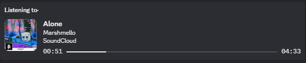

#  Discord Music RPC

**Discord Music RPC** is an open-source project that combines a **Chrome extension** with an **Electron-based desktop application**, allowing users to display their currently playing music from supported websites directly in their Discord status via Rich Presence. 

It works by running a lightweight Electron app that acts as a bridge between the browser extension and the Discord client, enabling seamless music status updates across a wide range of platforms.

What sets it apart is its **customizable selector system** — no coding required. Users can easily create their own music parsers for any website by simply selecting elements on the page. This makes it possible to support virtually any music platform, even those not officially integrated.



## 📚 Table of Contents

- [Features](#-features)
- [Setup](#-setup)
- [How to Add a New Music Site](#-how-to-add-a-new-music-site)
- [Troubleshooting](#-troubleshooting)
- [Developer Setup](#-developer-setup)
- [Contributing](#-contributing)
- [License](#-license)

## 🚀 Features

- Real-time Discord Rich Presence updates
- Support for multiple platforms (e.g., YouTube, YouTube Music, Deezer, SoundCloud)
- Lightweight, modular architecture
- Easy to extend — add support for any music site using the built-in selector system
- Cross-platform Electron desktop app (Windows support, Linux/Mac planned)
- Automatic updates with seamless integration between the Electron app and Chrome extension
- Open-source and community-driven project

---

## 💻 Compatibility

OS

- **Windows**

Browser

- **Chrome**
- **Microsoft Edge**
- **Opera**
- **Brave**
- **Firefox**

---

## 🔧 Setup

### 1. Install the extension

**Install the Chrome extension**

- Open Chrome and go to chrome://extensions/
- Enable Developer Mode.
- Drag and drop the ZIP file of the extension into the extensions page.

**Install the Firefox extension**

- Open Firefox and go to about:addons
- Click on the gear icon in the top-right corner and select "Debug Add-ons".
- Drag and drop the ZIP file of the extension into the extensions page.

### 2. Install and Run the application

The application will run silently in the tray menu. you can right click if you want to check its status.
You can control the startup options of the application from this tray menu.

That's it! Now play music on any supported site, and your Discord status will update automatically.

---

### 💡 Extra Help for New Users

If you're new to using browser extensions or not sure how this works, here's a simple step-by-step guide:

1. **Install the Extension and Application**
   First, make sure the extension is installed in your browser. It usually appears in the window that opens when you click on the extensions icon (like a puzzle piece) next to the address bar.
   Then make sure you have installed the application and that the server is running (tray menu - right click).

2. **Play Music**
   Go to a supported music site (like YouTube Music, Deezer, Soundcloud, etc.) and start playing music.

3. **Check Your Discord Status**
   Open Discord and look at your status — it should now show what you're listening to!

4. **How to Disable It on Certain Pages**
   If you don't want the extension to detect music on a certain website:

   - Click on the extension icon (top-right of your browser)
   - A small popup will appear
   - Use the switch to turn off detection for that page

---

## 🐞 Troubleshooting

If your status isn't updating:

- Make sure the local server is running.
- Confirm that the browser extension is active on the music site.
- Make sure the song is playing and not muted.
- Make sure the tab playing music is not minimized.
- Make sure the discord is running.
- Make sure that "Display current activity as a status message" is enabled in Discord.
- Check the console for errors and logs. For the server, right click on the Tray application and click on “open logs”.

## 💻 Developer Setup

To set up the project locally:

```bash
git clone https://github.com/KanashiiDev/discord-music-rpc.git
cd discord-music-rpc
npm install
```

#### Run the server in development mode

```bash
npm start
```

#### Run the app in development mode

```bash
npm start:app
```

---

## 💻 Available NPM Scripts

<details>
<summary>Click to view</summary>

### Start & Development

- **`npm start`**
  Starts the Node.js backend server.

- **`npm run start:app`**
  Launches the Electron application for desktop testing.

---

### Application Build

- **`npm run build`**
  Builds a Windows 64-bit Electron application.

- **`npm run pack`**
  Creates the app directory without generating an installer (`--dir` mode).

---

### Browser Extension Build

- **`npm run build:chrome`**
  Builds the Chrome extension using `TARGET=chrome` with `buildExtensions.js`.

- **`npm run build:firefox`**
  Builds the Firefox extension using `TARGET=firefox` with `buildExtensions.js`.

- **`npm run build:extensions`**
  Builds both Chrome and Firefox extensions.

---

### Browser Extension Packaging (ZIP)

- **`npm run pack:chrome`**
  Zips the Chrome extension into a distributable format.

- **`npm run pack:firefox`**
  Zips the Firefox extension into a distributable format.

- **`npm run pack:extensions`**
  Zips both Chrome and Firefox extensions.

---

### Combined Build & Package

- **`npm run build-and-pack`**
  Builds and packages both Chrome and Firefox extensions.

- **`npm run build-and-pack:chrome`**
  Builds and packages only the Chrome extension.

- **`npm run build-and-pack:firefox`**
Builds and packages only the Firefox extension.
</details>

---

## 🧩 How to Add a New Music Site

This guide explains how to create and use music parsers that extract song info (title, artist, album image, duration, etc.) from music websites.

You can add a parser in **two ways**:

---

<details>
<summary>Click to view</summary>

## ✨ Option 1: Add Parser with Plugin UI (No Code) (for simple websites)

**You don’t need to write any code. Just follow these steps:**

1. **Click the plugin icon** in your browser.
2. Click **"Add Music Parser"**.
3. On the opened section, click the **“+” icon** next to each required element:
   - Title
   - Artist
   - Album Image
   - (Optional) Time Passed / Duration
4. In the **“Most Stable Selector”** section, choose the selector that looks the cleanest and most stable.
5. Click **"Save"** and refresh the page.

**Notes**

* If only **“Duration”** is available, you can still add it. The app will calculate playback time starting from when the song changes until the full duration is reached.
* If **“Time Passed”** and **“Duration”** are combined (e.g., `0:12 / 2:20`), you can use the same selector for both.
* You can add any link you want in the **“Link”** field, or leave it blank. If left blank, the current site’s address will be used automatically.
* To apply your parser to the entire site, simply leave the **regex** field empty.
* You can add multiple regex patterns. There are two ways to do this:
  1. `regex1,regex2`
  2. `[/regex1/, /regex2/]`

---

## 🔧 Option 2: Add Parser Using Code (for more advanced websites)

You can also manually register a parser with JavaScript using the `registerParser()` function.
Create a new file in the `extension/parsers/` directory, named `<yourSite>.js`. Use this template:

```js
registerParser({
  domain: "example.com", // Website domain
  title: "Example", // Display title
  urlPatterns: [/.*/], // Only run on specific paths (Regex)

  fn: function () {
    // You can define and use helper functions here if needed
    return {
      title: getText(".now-playing-title"), // Song title
      artist: getText(".now-playing-artist"), // Artist name
      image: getImage("img.album_art"), // Album image
      timePassed: getText(".time-display-played"), // Played time (optional)
      duration: getText(".time-display-total"), // Total duration (optional)
      source: "Example", // Source label
      songUrl: "example.com", // Link to song/station (optional)
    };
  },
});
```

---

## 🔧 Available Helpers

### `getText(selector, options?)`

Gets text or attribute from an element.

```js
getText(".title"); // Gets textContent
getText(".link", { attr: "href" }); // Gets attribute
getText(".song", {
  attr: "href",
  transform: (v) => v.slice(1), // Transforms "/song" → "song"
});
```

---

### `getImage(selector)`

Gets image `src` or CSS `background-image` URL from an element.

```js
getImage(".cover img");
```

---

## 📝 Tips

- Always provide `title`, `artist`, and `image` when available.
- Use `urlPatterns` to limit the parser to specific pages.
- If time info is available, include `timePassed`, `duration` to calculate `position`, `progress`, and timestamps.
- Use `getText` and `getImage` to keep your code clean and reliable.
- Use your browser’s developer tools (right-click > Inspect) to find the correct selectors.

</details>

---

## 🧑‍💻 How to Test the Extension on Chrome

To test the extension locally in Chrome:

1. Open **Chrome** and go to `chrome://extensions/`.
2. Enable **Developer mode** in the top right.
3. Click the **Load unpacked** button.
4. Select the extension folder.
5. The extension will now be loaded into Chrome. You can test it on any supported music website!

> 💡 **Note:** To update the extension after making changes, just click the **Reload** button in the `chrome://extensions/` page.

---

## 🛠️ Contributing

Contributions are welcome! You can:

- Add support for new sites
- Report bugs or suggest features
- Improve existing parsers

Feel free to open an issue or submit a pull request.

---

## 📄 License

This project is licensed under the MIT License. See the `LICENSE` file for details.

---

**Tags**: Discord Rich Presence, Music RPC, Radio RPC, Chrome Extension, Music Status, Open Source, Electron App
